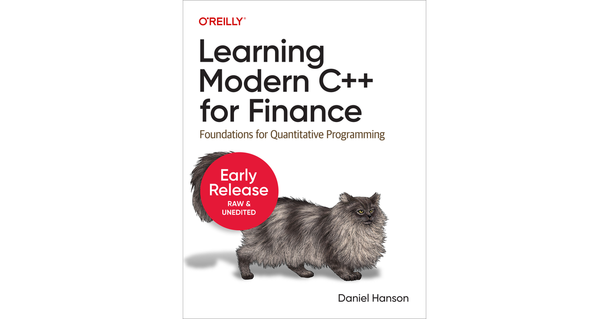

# Learning Modern C++ for Finance by Reilly: Code Repository

## Overview
This repository is dedicated to the practical application and exploration of concepts presented in "Learning Modern C++ for Finance" by Reilly. It aims to provide a comprehensive collection of examples, exercises, and projects developed through the insights gained from the book. This repository serves as a resource for finance professionals, students, and enthusiasts looking to deepen their understanding of modern C++ in the context of financial engineering and computational finance.

## Objectives
- **Educational Enhancement:** Enhance the learning experience for readers of "Learning Modern C++ for Finance" by providing real-world code examples and projects.
- **Community Collaboration:** Foster a community of learners and professionals who can share insights, ask questions, and improve upon the provided examples.
- **Continuous Learning:** Keep the content up-to-date with the latest C++ standards and practices relevant to finance.

## Repository Structure

Here's an overview of the chapters and sections available in this repository:

| Chapter | Description | Link |
|---------|-------------|------|
| Chapter 1: An Overview of C++ | Introduction to C++ and its application in quantitative finance. | [View](Chapter_1_An_Overview_of_C++) |
| Chapter 2: Some Mechanics of C++ | Detailed discussion on C++ mechanics like vectors, enums, and control structures. | [View](Chapter_2_Some_Mechanics_of_C++) |
| Chapter 3: Writing User-Defined Functions and Classes in Modules | How to use modules for structuring user-defined functions and classes. | [View](Chapter_3_Writing_User-Defined_Functions_and_Classes_in_Modules) |
| Chapter 4: Dates and Fixed Income Securities | Handling dates and working with fixed income securities in C++. | [View](Chapter_4_Dates_and_Fixed_Income_Securities) |
| Chapter 5: Linear Algebra | Introduction to linear algebra in C++ and its applications. | [View](Chapter_5_Linear_Algebra) |

- **Exercises:** Practical exercises with solutions for readers to apply what they've learned.
- **Projects:** Larger, more complex projects that integrate multiple concepts from the book.
- **Resources:** Additional resources and links for further learning, including official C++ documentation, finance libraries, and tools.

## How to Use This Repository
1. **Clone or Fork the Repository:** Get started by cloning the repository or forking it to your account for personal exploration and modification.
2. **Navigate to Chapter Folders:** Each chapter from the book has a corresponding folder with examples and exercises.

## Contributing
We welcome contributions from readers and the community. Before contributing, please review the contribution guidelines.

- **Issue Reporting:** Report issues or suggest improvements by opening an issue.
- **Pull Requests:** Feel free to submit pull requests with enhancements, new examples, or fixes to existing content. Please ensure your code adheres to the coding standards outlined in the contribution guidelines.

## License
This repository is licensed under the GNU License, allowing for the reuse and distribution of code examples and resources. Please review the license terms before using or contributing to the repository.
